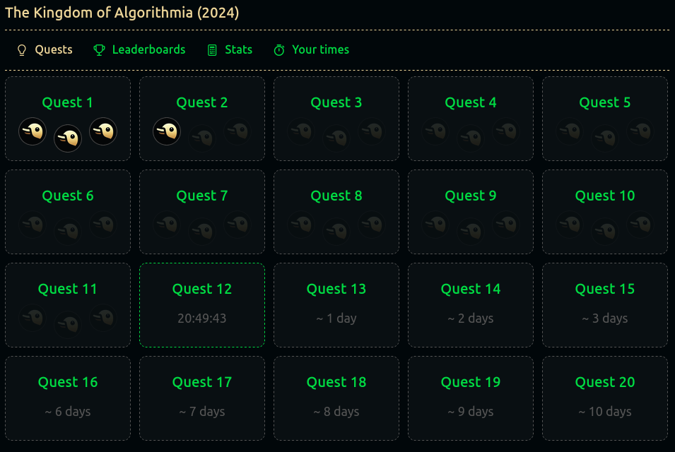

# Coding Competitions

## Advent Of Code

[Advent Of Code](https://adventofcode.com/) is an Advent calendar of small programming puzzles for a variety of skill sets and skill levels that can be solved in any programming language you like.

+ [Advent of Code 2025](https://github.com/codingcompetitions/AoC-2025) is solved using [SBCL](http://www.sbcl.org/).
+ [Advent of Code 2024](https://github.com/codingcompetitions/AoC-2024) is solved using [Perl](https://www.perl.org/).
+ [Advent of Code 2023](https://github.com/codingcompetitions/AoC-2023) is solved using [Java](https://openjdk.org/projects/jdk/).
+ [Advent of Code 2022](https://github.com/codingcompetitions/AoC-2022) is solved using [Elixir](https://elixir-lang.org/).
+ [Advent of Code 2021](https://github.com/codingcompetitions/AoC-2021) is solved using [Racket](https://racket-lang.org/).
+ [Advent of Code 2020](https://github.com/codingcompetitions/AoC-2020) is solved using [TypeScript](https://www.typescriptlang.org/).
+ [Advent of Code 2019](https://github.com/codingcompetitions/AoC-2019) is solved using [PHP](https://www.php.net/)
+ [Advent of Code 2018](https://github.com/codingcompetitions/AoC-2018) is solved using [Ruby](https://www.ruby-lang.org/en/).
+ [Advent of Code 2017](https://github.com/codingcompetitions/AoC-2017) is solved using [C](https://gcc.gnu.org/).
+ [Advent of Code 2016](https://github.com/codingcompetitions/AoC-2016) is solved using [Rust](https://www.rust-lang.org/).
+ [Advent of Code 2015](https://github.com/codingcompetitions/AoC-2015) is solved using [Python](https://www.python.org/).
+ [Advent of Code Data](https://github.com/codingcompetitions/AoC-data).

## Advent Of SQL

+ [Advent of SQL 2024](https://github.com/codingcompetitions/AoSQL-2024) is solved using [PostsgreSQL](https://www.postgresql.org/).
+ [Advent of SQL Data](https://github.com/codingcompetitions/AoSQL-data).

## Codyssi

+ [Codyssi 2024](https://github.com/codingcompetitions/cod-2024) is solved using [Racket](https://racket-lang.org/).
+ [Codyssi Data](https://github.com/codingcompetitions/cod-data). 

## Coding Quest

+ [Coding Quest 2024](https://github.com/codingcompetitions/CQ-2024) is solved using [Ruby](https://www.ruby-lang.org/en/).
+ [Coding Quest 2023](https://github.com/codingcompetitions/CQ-2023) is solved using [PHP](https://www.php.net/).
+ [Coding Quest Data](https://github.com/codingcompetitions/CQ-data).

## Everybody Codes

+ [Everybody Codes Stories](https://github.com/codingcompetitions/EC-Stories) is solved using [PHP](https://www.php.net/).
+ [Everybody Codes 2024](https://github.com/codingcompetitions/EC-2024) is solved using [Ruby](https://www.ruby-lang.org/en/).
+ [Everybody Codes Data](https://github.com/codingcompetitions/EC-data).

## Hanukkah of Data

+ [Hanukkah Of Data](https://github.com/codingcompetitions/HoD) is solved using [SQLite](https://www.sqlite.org/).

## UVa Online Judge

+ [UVa Online Judge](https://github.com/codingcompetitions/UVa-online-judge) is solved using [Python](https://www.python.org/).

## Google

+ [coding-competitions-archive](https://github.com/codingcompetitions/coding-competitions-archive)

## Coding Competitions

+ [Coding Competitions](https://github.com/codingcompetitions/.github)
